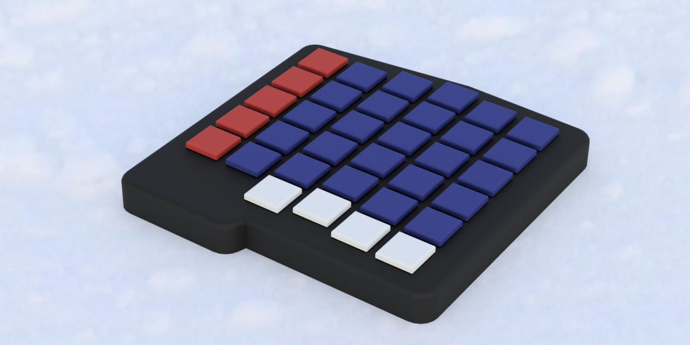
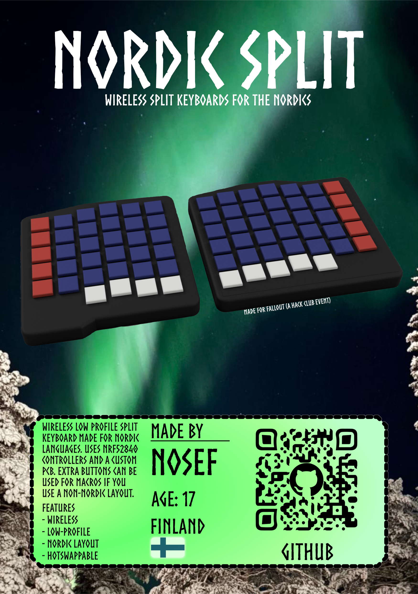

# Nordic split

A split low-profile wireless keyboard with a nordic ISO layout. I used the [Caldera Keyboard by Christian Selig](https://github.com/christianselig/caldera-keyboard) as inspiration and it clearly shows in the design. Still  The keyboard uses a nice!nano like microcontroller based on the NRF52840, ZMK as the firmware and a custom pcb with Choc V1 hotswap sockets.

The project was made as a part of Hack Club's [Fallout](https://fallout.hackclub.com/) event.

## Highlights

* **Hotswapping**
* Open-source
* Wireless
* Nordic layout
* total of 74 keys

## Why it exists?

The project was made because I wanted a split keyboard but needed a nordic layout for my day to day stuff (I need the letters Ä, Ö, Å). So the nordic split was born. I took inspiration from the caldera keyboard. It's low profile so it can be transported easily around and it's also wireless so no need for annoying dual or split cables for connecting to a computer. 

Even though it was designed as nordic layout first. The keyboard could also be used by people with non-nordic layouts and you could use the extra row of keys on the right side as shortcut or macro keys. Of course also the pcb could be edited and these keys removed if you don't want them.

## Build guide

### Ordering parts

First you need to order the PCBs from a PCB manufacturer. (Technically nothing prevents you from hand wiring this keyboard but it would require some redesigning of the case and is outside the scope of my project.) I ordered the PCB with the diodes installed. They are pretty annoying to hand solder because of their small size and are not that much more expensive to get preassembled from manufacturers like [JLCPCB](https://jlcpcb.com/). When buying the microcontroller you should probably not buy a nice!nano and instead just a NRF52840 based dev board. This is the one I bought [ProMicro NRF52840](https://www.aliexpress.com/item/1005007205026373.html?spm=a2g0o.productlist.main.8.5285a54cPOmIpa&aem_p4p_detail=202603200108531573820844269200000457052&algo_pvid=ebbbcca8-17d4-4ca8-b59a-75b1f3198b0b&algo_exp_id=ebbbcca8-17d4-4ca8-b59a-75b1f3198b0b-7&pdp_ext_f=%7B%22order%22%3A%22771%22%2C%22eval%22%3A%221%22%2C%22fromPage%22%3A%22search%22%7D&pdp_npi=6%40dis%21EUR%214.49%213.16%21%21%2134.88%2124.54%21%40211b813f17739941330401522ee8fd%2112000039797470328%21sea%21FI%210%21ABX%211%210%21n_tag%3A-29910%3Bd%3Ab451bb2c%3Bm03_new_user%3A-29895%3BpisId%3A5000000197850273&curPageLogUid=OxA2oroU7gov&utparam-url=scene%3Asearch%7Cquery_from%3A%7Cx_object_id%3A1005007205026373%7C_p_origin_prod%3A&search_p4p_id=202603200108531573820844269200000457052_2) from aliexpress and it's pretty much a drop in replacement for the nice!nano.

 For the other components you can look at [Bill of Materials](./BOM.csv). 

### The case

For the case you can either print it or use a 3D printing service. I have a 3D printer so I printed one myself but manufacturers like [JLC3DP](https://jlc3dp.com/) can print the case for you. Remeber that the size are not just mirrored and have different case files. All 3d files are in the [Fusion Files folder](./FusionFiles/). The bottom plate is printed seperately and the top plate and sides are all on assembly that can be printed in place. Depending on the print quality you may want to wet sand the parts and add a few coats of paint. This isn't strictly necessary but it can improve the feel and finish of the part and can make them look better. 

After printing and finishing you can use the press with inserts for the screws. You should attach them to the case assembly (there are pre made holes for them). After this you can move onto preparing the PCB for assembly.

### Working on the PCB. 

First you should attach the diodes and hotswap sockets (These might be preinstalled if you used an asssembly service when ordeing the parts from the manufacturer). Then you should install the dev board (ProMicro NRF52840 if you followed the BOM). You should have pre-installed pins on the board and you can solder it to the pcb using them. Now I would suggest connecting to a computer and flashing the software (Available here!). You can use metallic tweezers to connect test each socket without installing switches. (Just bridge the two points). 

After you have tested each key and checked that it works you can move onto the next step. If it doesn't work check your soldering of the dev board and check the PCB. When ordering from companies like JLCPCB you usually have to get a min of 5 boards. You can try one of the other boards incase one of the PCBs had a manufacturing mistake etc. 

If everything works you should move onto installing the battery leads. You can solder the battery to the pads on the PCB check that you attach the positive side to the BAT+ pad and the negative side to the GND pad. After this you can install the PCB into the case and attach the battery to the bottom plate. (Having long enough battery cables might be a help here.) Then you can screw the bottom plate in and move onto installing the switches. 

### The switches

You should be able to just push in every switch. The hotswap sockets make this possible and there is no need to solder anything on the switches themselves. After the switches you should once again plug in both boards and check the firmware. You should sync the boards together and test the wireless functionality. If everything works as intended you can install the keycaps and then your done.

### Build Guide Summary

1. Order PCB and other parts.
2. Order or print the case.
3. Solder parts to the PCBs (Diodes, hotswap-sockets, microcontroller)
4. Install the heated threaded inserts to the spots in the case (4 per side)
5. Install the PCB to the case.
6. Install top plate.
7. Install the choc switches to the sockets and keycaps.
8. Flash software (Check software section)
9. Enjoy!

## Software

The keyboard is running ZMK which is the standard software used for wireless custom keyboards. Here is the [official docs for ZMK](https://zmk.dev/docs/features/split-keyboards). You might want to read this if you want to know more. I will still provide some instructions and info here as well as my own config file but if you need something else you should check the ZMK page.

The main points you might want to know are that one of the sides will be the host and it will drain more battery then the other side. This is because the "host" side will be communicating between the computer and the other side and the non host side will be just communicating with the host side. With the size of the batteries I used this wont be an issue but this technically means that you could use a bit of a smaller battery on one side and have the same battery life as the host side.

## PCB

Here is a picture of the left side PCB. You can see the switches, traces and a spot for the microcontroller.

Here is a picture of the left side PCB. You can see that it is different from the left side instead of just being a mirrored version like some boards are. 

Unlike some other split keyboards the Nordic Splits halves aren't mirrored but instead the right side has an extra row of keys primarly needed to support the Nordic layout. 

## Zine Page

Zine page is also available as a [PDF](./ZinePage/ZinePage.pdf). T
Background picture was taken by my dad when we went up north.

## Demo

A video of the keyboard in use.

SOON

## Acknowledgements

* [HackClub Fallout](https://fallout.hackclub.com/)
* [Caldera Keyboard by Christian Selig](https://github.com/christianselig/caldera-keyboard)

## Tools used

### Design

* KiCad (PCB design)
* Fusion (Case design)
* Excalidraw (Notetaking)

### Assembly 

* Soldering iron