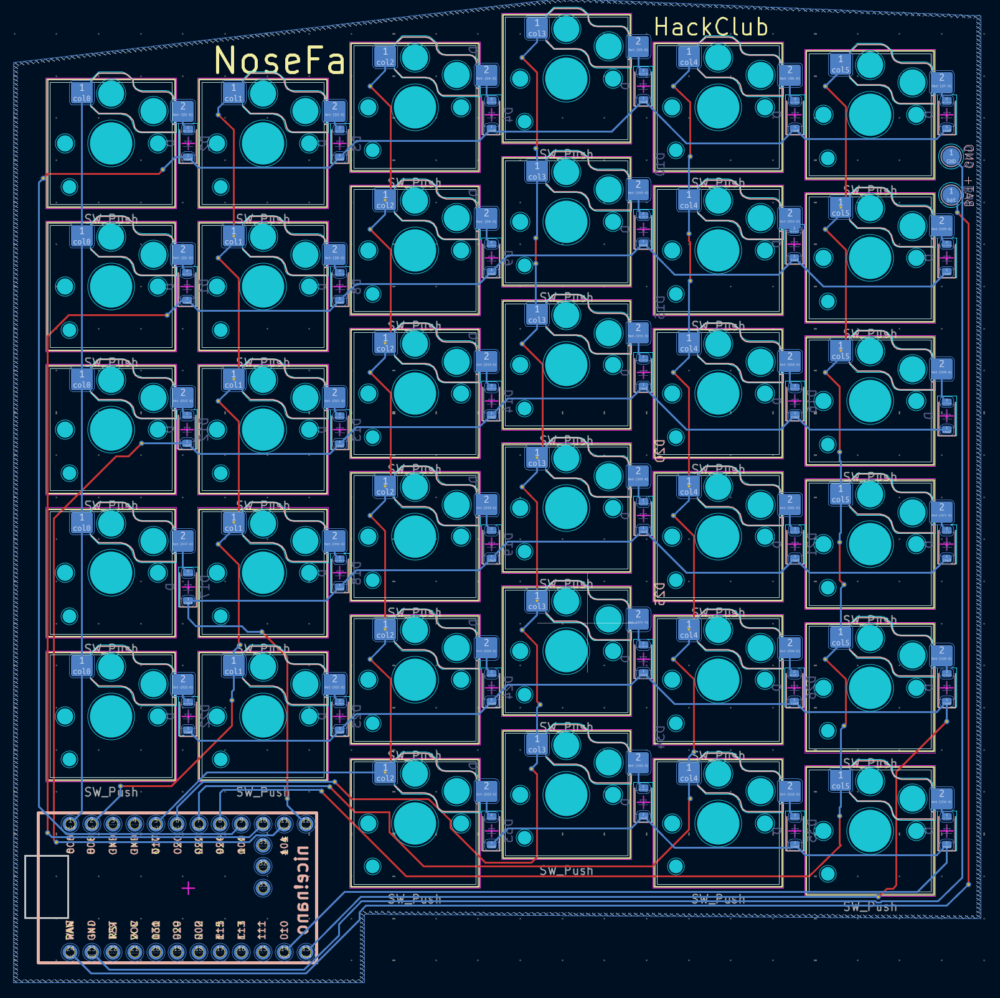
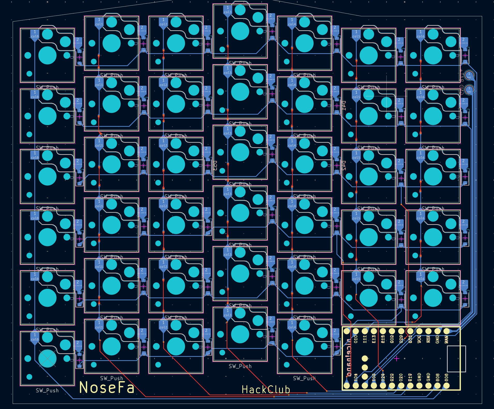

# Nordic split

A split low-profile wirelles keyboard with a nordic ISO layout. Some inspiration was taken from the cladera keyboard. The keyboard uses a nice!nano as the controller, ZMK as the firmware and a custom pcb with choc v2 hotswap sockets.

The project was made as a part of HackClub's Fallout event.

## Highlights

* **Hotswapping**
* Open-source
* Wireless
* Nordic layout

## Why it exists?

The project was made because I wanted a split keyboard but needed a nordic layout for my day to day. So the nordic split was born. It has most of the features I wanted. It's low profile so it can be transported easily around and it's also wireless so no need for annoying dual or split cables for connection.

The keyboard could also be used by people with non-nordic layouts and the extra row of keys on the right side could be shortcut or macro keys. Of course the pcb could be edited and these keys removed

## Photos

Screenshot of the left side PCB

Screenshot of the right side PCB

## Demo

A video of the keyboard in use.

SOON

## Acknowledgements

 -[HackClub Fallout](https://fallout.hackclub.com/)
 -[Caldera Keyboard by Christian Selig](https://github.com/christianselig/caldera-keyboard)
