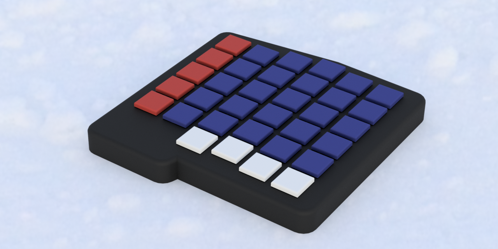
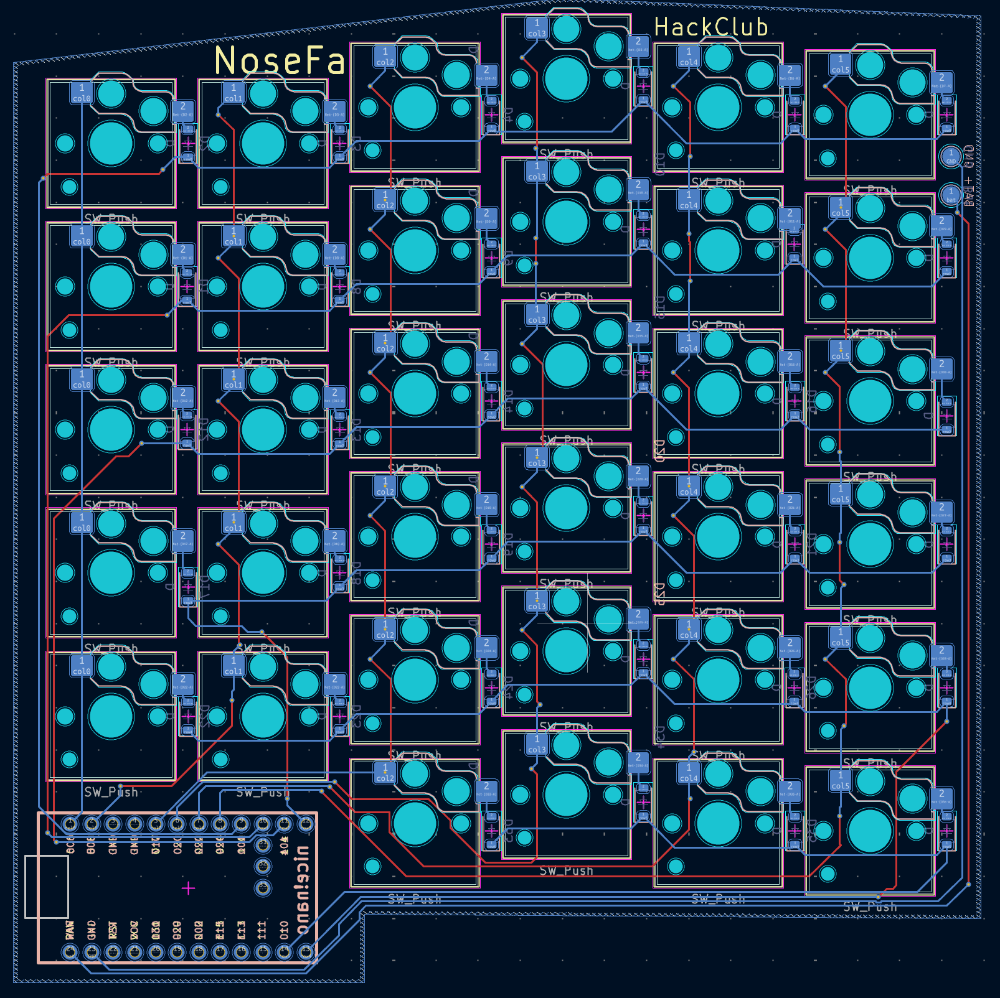
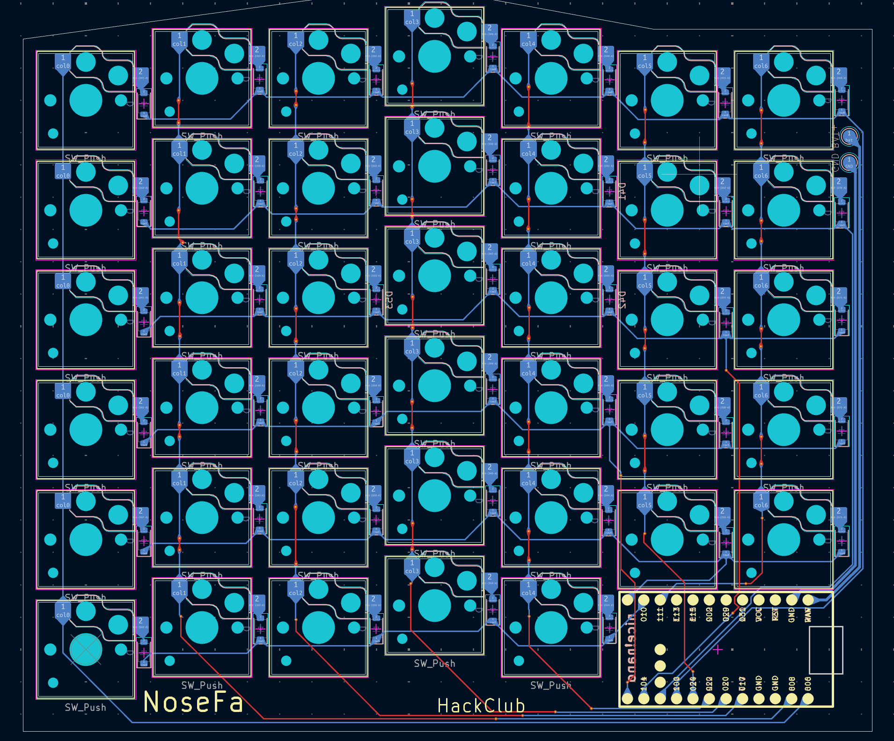
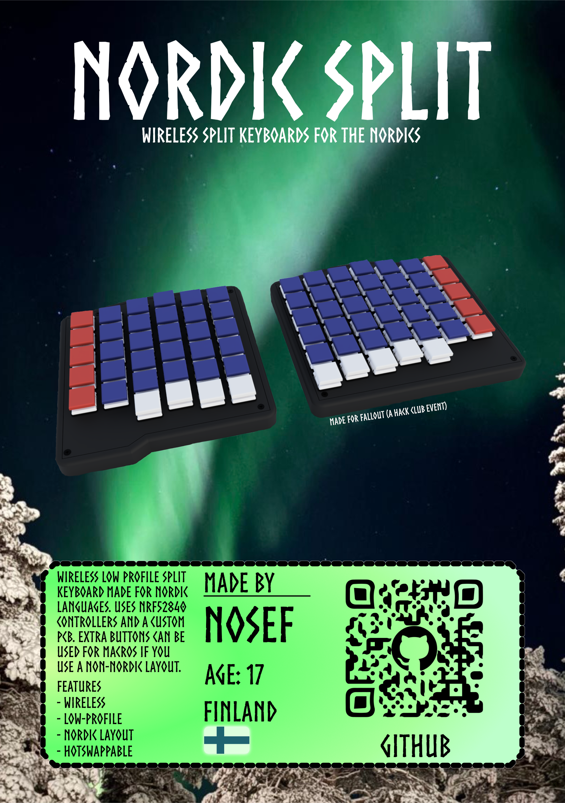

# Nordic split

A split low-profile wireless keyboard with a nordic ISO layout. I used the [Caldera Keyboard by Christian Selig](https://github.com/christianselig/caldera-keyboard) as inspiration and it clearly shows in the design. Still the keyboard uses a nice!nano like microcontroller based on the NRF52840, ZMK as the firmware and a custom pcb with Choc V1 hotswap sockets. The keyboard also has an ortholinear layout which can be more ergonomic for some users.

The project was made adn designed as a part of Hack Club's [Fallout](https://fallout.hackclub.com/) event where people make hardware projects and get a chance to go to Shenzhen, China.

## Highlights

* **Hotswapping**
* Open-source
* Wireless
* Nordic layout
* total of 74 keys

## Why it exists?

The project was made because I wanted a split keyboard but needed a nordic layout for my day to day stuff (I need the letters Ä, Ö, Å). So the nordic split was born. I took inspiration from the caldera keyboard by Christian Selig. It's low profile so it can be transported easily around and it's also wireless so no need for annoying dual or split cables for connecting to a computer or laptop.

Even though it was designed as nordic layout first. The keyboard could also be used by people with non-nordic layouts and you could use the extra row of keys on the right side as shortcut or macro keys. Of course also the pcb could be edited and these keys removed if you don't want them.

## Build guide

### Ordering parts

First you need to order the PCBs from a PCB manufacturer. (Technically nothing prevents you from hand wiring this keyboard but it would require some redesigning of the case and is outside the scope of my project.) I ordered the PCB with the diodes installed. They are pretty annoying to hand solder because of their small size and are not that much more expensive to get preassembled from manufacturers like [JLCPCB](https://jlcpcb.com/). When buying the microcontroller you should buy a NRF52840 based dev board just check that it has the same pin layout etc. This is the one I bought [ProMicro NRF52840](https://www.aliexpress.com/item/1005007205026373.html?spm=a2g0o.productlist.main.8.5285a54cPOmIpa&aem_p4p_detail=202603200108531573820844269200000457052&algo_pvid=ebbbcca8-17d4-4ca8-b59a-75b1f3198b0b&algo_exp_id=ebbbcca8-17d4-4ca8-b59a-75b1f3198b0b-7&pdp_ext_f=%7B%22order%22%3A%22771%22%2C%22eval%22%3A%221%22%2C%22fromPage%22%3A%22search%22%7D&pdp_npi=6%40dis%21EUR%214.49%213.16%21%21%2134.88%2124.54%21%40211b813f17739941330401522ee8fd%2112000039797470328%21sea%21FI%210%21ABX%211%210%21n_tag%3A-29910%3Bd%3Ab451bb2c%3Bm03_new_user%3A-29895%3BpisId%3A5000000197850273&curPageLogUid=OxA2oroU7gov&utparam-url=scene%3Asearch%7Cquery_from%3A%7Cx_object_id%3A1005007205026373%7C_p_origin_prod%3A&search_p4p_id=202603200108531573820844269200000457052_2) from aliexpress and the PCB and software have been made for this.

For the case you can either 3D print it your self or you can use a manufacturer like [JLC3DP](https://jlc3dp.com/) to print the case. Using a printing service isn't listed in the BOM because I have a 3D printer that I can use for this. Remember to order both sides. So in total you should have different 4 parts to print (both sides have a case and bottom plate). You can find the files in the [3D files folder](./3dFiles/). The [Full project folder](./3dFiles/FullProject/) has the full 3D project inc. PCB, switches etc. It's available in .step and .f3d formats. There is also a [Printable folder](./3dFiles/Printable/). It has ready to print files in .step format. All parts can be printed in place without supports. 

For the other components like switches etc. you can look at [Bill of Materials](./BOM.csv). The switches are the ones I used but you can use any choc v1 low-profile switches.

### The case

Depending on the print quality you may want to wet sand the parts and add a few coats of paint. This isn't strictly necessary but it can improve the feel and finish of the part and can make them look better.

After printing and finishing you can press in the heated inserts to the main shell of both sides. You should attach them to the case assembly (there are pre made holes for them). After this you can move onto preparing the PCB for assembly.

### Working on the PCB

First you should attach the diodes and hotswap sockets (These might be preinstalled if you used an asssembly service when ordeing the parts from the manufacturer). Then you should install the dev board (ProMicro NRF52840 if you followed the BOM). You should have pre-installed pins or pins installed by you on the board and you can solder it to the pcb using them. Now I would suggest connecting to a computer and flashing the software (See [software flashing section](./Software/software.md) if you need help). You can use metallic tweezers to bridge a connection and test each socket without installing switches (Just bridge the two points). 

After you have tested each key and checked that it works you can move onto the next step. If it doesn't work check your soldering of the dev board and check the PCB. When ordering from companies like JLCPCB you usually have to get a min of 5 boards so you have extras just incase. You can try one of the other boards incase one of the PCBs had a manufacturing mistake etc. 

If everything works you should move onto installing the battery leads. You can solder the battery to the pads on the PCB check that you attach the positive side to the BAT+ pad and the negative side to the GND pad. After this you can install the PCB into the case and attach the battery to the bottom plate. (Having long enough battery cables might be a help here.) Then you can screw the bottom plate in and move onto installing the switches. Both sides can be assembled in the same way so you can follow this guide for both.

### The switches

You should be able to just push in every switch. The hotswap sockets make this possible and there is no need to solder anything on the switches themselves. After the switches you should once again plug in both boards and check the firmware. You should sync the boards together and test the wireless functionality. If everything works as intended you can install the keycaps and then your done.

### Build Guide Summary

1. Order PCB and other parts.
2. Order or print the case.
3. Solder parts to the PCBs (Diodes, hotswap-sockets, microcontroller)
4. Install the heated threaded inserts to the spots in the case (4 per side)
5. Install the PCB to the case.
6. Install top plate.
7. Install the choc switches to the sockets and keycaps.
8. Flash software (Check software section)
9. Enjoy!

## Software

See [Software.md](./Software/software.md) for more info about software and software installation instructions.

## PCB

Here is a picture of the left side PCB. You can see the switches, traces and a spot for the microcontroller.

Here is a picture of the left side PCB. You can see that it is different from the left side instead of just being a mirrored version like some boards are.

Unlike some other split keyboards the Nordic Splits halves aren't mirrored but instead the right side has an extra row of keys primarly needed to support the Nordic layout.

## Zine Page

Zine page is also available as a [PDF](./ZinePage/ZinePage.pdf). 
Background picture was taken by my dad when we went up north.

## Demo

A video of the keyboard in use.

SOON

## Acknowledgements

* Thanks to [Hack Club](https://hackclub.com/) [Fallout](https://fallout.hackclub.com/). If you want to view the project I made for Fallout including journals you can view it [on the event page](https://fallout.hackclub.com/projects/156).
* [Caldera Keyboard by Christian Selig](https://github.com/christianselig/caldera-keyboard) was used as inspiration and [his video](https://www.youtube.com/watch?v=7UXsD7nSfDY) was a great watch.

## Tools used

### Design

* KiCad (PCB design)
* Fusion (Case design)
* Excalidraw (Notetaking)

### Assembly

* Soldering iron
* Screwdriver for the M2 screws
* Computer to flash the software.
* USB-C cable
