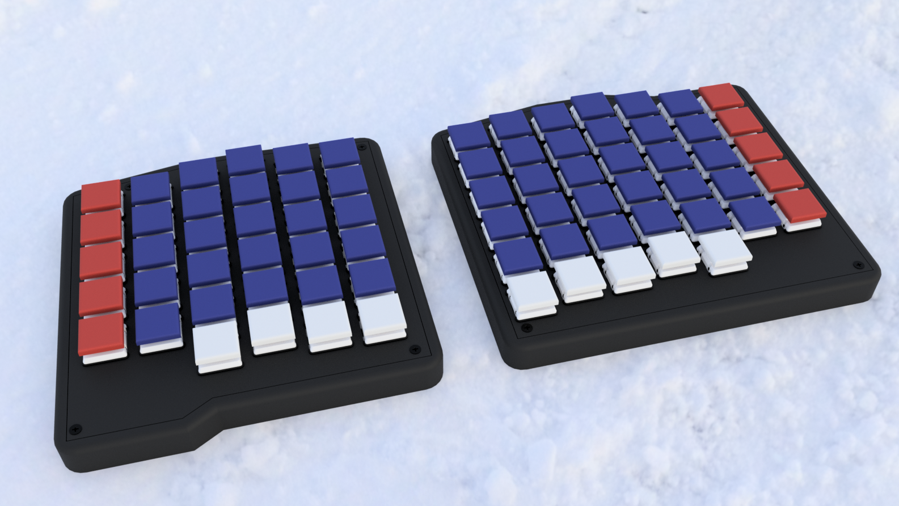
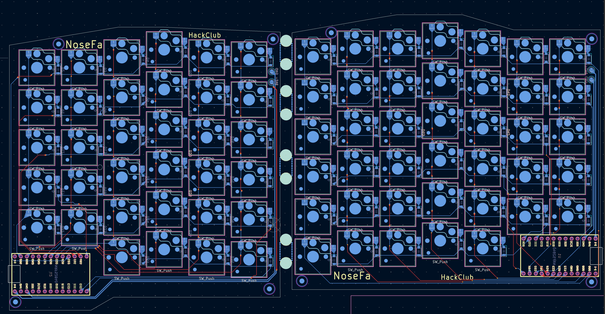
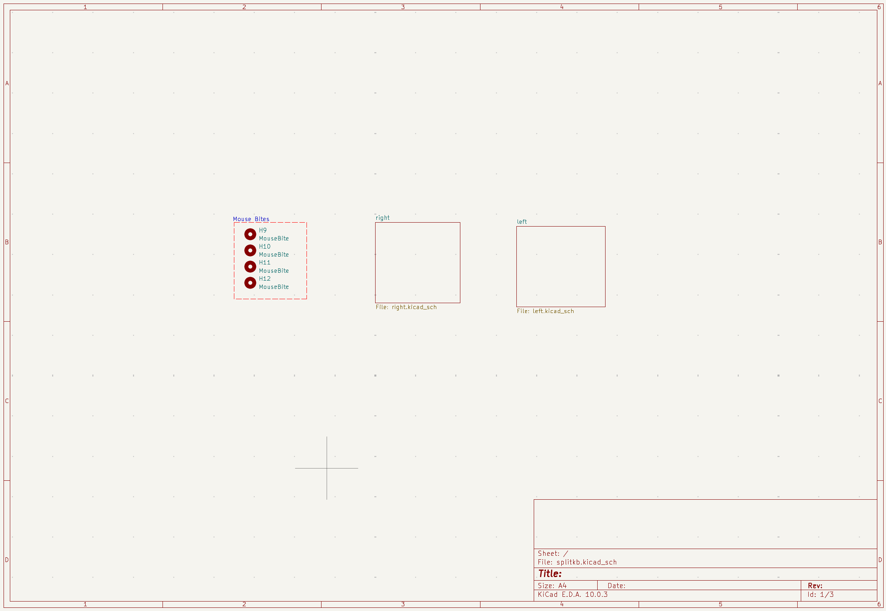
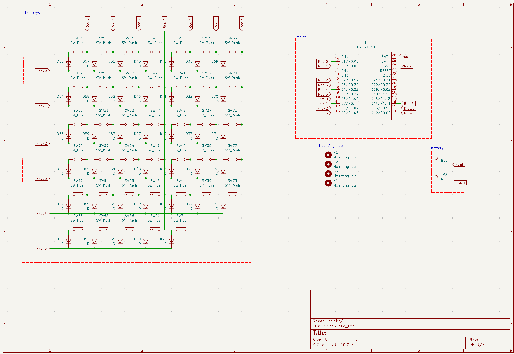
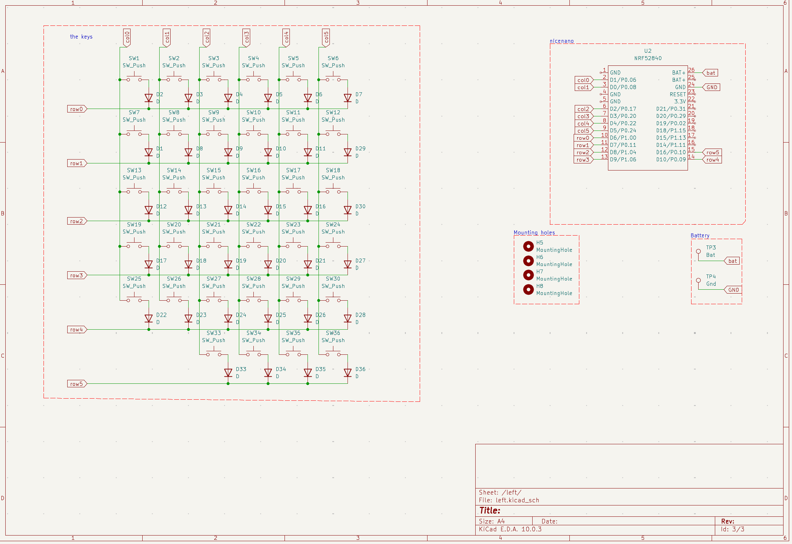
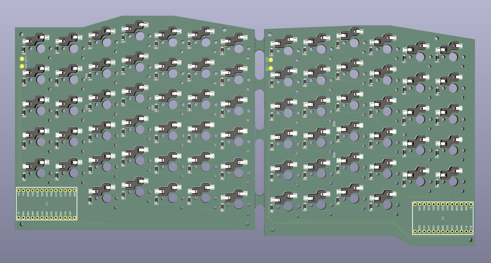

# Nordic split

A split low-profile wireless keyboard with a nordic ISO layout. I used the [Caldera Keyboard by Christian Selig](https://github.com/christianselig/caldera-keyboard) as inspiration and it clearly shows in the design. Still the keyboard uses a nice!nano like microcontroller based on the same NRF52840, ZMK as the firmware and a custom pcb with Choc V1 hotswap sockets. The keyboard also has an ortholinear layout which can be more ergonomic for some users.

The project was made and designed as a part of Hack Club's [Fallout](https://fallout.hackclub.com/) event where people make hardware projects and get a chance to go to Shenzhen, China. This was also one of my first electronics projects.

## Highlights

* **Hotswapping**
* Open-source
* ZMK firmware (ZMK studio support)
* Wireless
* Nordic layout
* total of 74 keys

## Why it exists?

The project was made because I wanted a split keyboard but needed a nordic layout for my day to day stuff (I need the letters Ä, Ö, Å). So the nordic split was born. I took inspiration from the Caldera keyboard by Christian Selig. It's low profile so it can be transported easily around and it's also wireless so no need for annoying dual or split cables for connecting to a computer or laptop.

This is the first keyboard I have designed so the keymap and layout were made with some educated guess work. They might be updated later down the line. I will update this repo with the most recent keymap I use. Even though it was designed as nordic layout first. The keyboard could also be used by people with non-nordic layouts and you could use the extra row of keys on the right side as shortcut or macro keys. Of course also the pcb could be edited and these keys removed if you don't want them. This keyboard has ZMK studio support so you can change the keymap in the [ZMK.studio web app](https://zmk.studio).

## BOM summary

* Pro Micro NRF52840 [Aliexpress](https://www.aliexpress.com/item/1005007205026373.html?spm=a2g0o.productlist.main.8.5285a54cPOmIpa&aem_p4p_detail=202603200108531573820844269200000457052&algo_pvid=ebbbcca8-17d4-4ca8-b59a-75b1f3198b0b&algo_exp_id=ebbbcca8-17d4-4ca8-b59a-75b1f3198b0b-7&pdp_ext_f=%7B%22order%22%3A%22771%22%2C%22eval%22%3A%221%22%2C%22fromPage%22%3A%22search%22%7D&pdp_npi=6%40dis%21EUR%214.49%213.16%21%21%2134.88%2124.54%21%40211b813f17739941330401522ee8fd%2112000039797470328%21sea%21FI%210%21ABX%211%210%21n_tag%3A-29910%3Bd%3Ab451bb2c%3Bm03_new_user%3A-29895%3BpisId%3A5000000197850273&curPageLogUid=OxA2oroU7gov&utparam-url=scene%3Asearch%7Cquery_from%3A%7Cx_object_id%3A1005007205026373%7C_p_origin_prod%3A&search_p4p_id=202603200108531573820844269200000457052_2)
* Kailh choc v1 low-profile switches [Aliexpress](https://www.aliexpress.com/item/1005008883418065.html?spm=a2g0o.productlist.main.4.7cffSf05Sf055m&aem_p4p_detail=20260608105333426421881451600004247855&algo_pvid=e48870db-5d73-4601-9782-786a12069ec8&algo_exp_id=e48870db-5d73-4601-9782-786a12069ec8-3&pdp_ext_f=%7B%22order%22%3A%221879%22%2C%22eval%22%3A%221%22%2C%22fromPage%22%3A%22search%22%7D&pdp_npi=6%40dis%21EUR%217.56%216.67%21%21%218.51%217.51%21%402103867617809412135648073eb0f2%2112000047082728972%21sea%21FI%210%21ABX%211%210%21n_tag%3A-29910%3Bd%3Ab451bb2c%3Bm03_new_user%3A-29895%3BpisId%3A5000000206890820&curPageLogUid=XxE2bfj9xego&utparam-url=scene%3Asearch%7Cquery_from%3A%7Cx_object_id%3A1005008883418065%7C_p_origin_prod%3A&search_p4p_id=20260608105333426421881451600004247855_1)
* 304050 Lithium-Polymer battery [42Keebs.eu](https://42keebs.eu/shop/parts/lithium-polymer-battery/?attribute_size=304050%20(600%20mAh))
* Kailh Low Profile Choc hotswap sockets [Aliexpress](https://www.aliexpress.com/item/1005008543325730.html?spm=a2g0o.productlist.main.1.4603mgNfmgNfuj&algo_pvid=141dd60b-ac8f-4dad-9c29-2c8b2cf925dd&algo_exp_id=141dd60b-ac8f-4dad-9c29-2c8b2cf925dd-0&pdp_ext_f=%7B%22order%22%3A%22523%22%2C%22spu_best_type%22%3A%22price%22%2C%22eval%22%3A%221%22%2C%22fromPage%22%3A%22search%22%7D&pdp_npi=6%40dis%21EUR%212.09%210.88%21%21%2116.26%216.85%21%40210388c917739980055733815e27c7%2112000046874184379%21sea%21FI%210%21ABX%211%210%21n_tag%3A-29910%3Bd%3Ab451bb2c%3Bm03_new_user%3A-29895%3BpisId%3A5000000197850290&curPageLogUid=gspRqJviDuAP&utparam-url=scene%3Asearch%7Cquery_from%3A%7Cx_object_id%3A1005008543325730%7C_p_origin_prod%3A)
* PCB [JLCPCB](https://cart.jlcpcb.com/quote?spm=jlcpcb.Public.2006)
* M2x8mm screws [Aliexpress](https://www.aliexpress.com/item/1005006995421098.html?spm=a2g0o.productlist.main.2.57264ed6EljEJ5&algo_pvid=026d2a42-6c71-4858-96d8-406083879f60&algo_exp_id=026d2a42-6c71-4858-96d8-406083879f60-1&pdp_ext_f=%7B%22order%22%3A%2222176%22%2C%22eval%22%3A%221%22%2C%22orig_sl_item_id%22%3A%221005006995421098%22%2C%22orig_item_id%22%3A%221005006674812661%22%2C%22fromPage%22%3A%22search%22%7D&pdp_npi=6%40dis%21EUR%214.63%210.86%21%21%2136.22%216.66%21%402103956b17767083060128755e3ad9%2112000038985462862%21sea%21FI%210%21ABX%211%210%21n_tag%3A-29910%3Bd%3A2599385b%3Bm03_new_user%3A-29895%3BpisId%3A5000000205009259&curPageLogUid=HEtOGF0Rf2DI&utparam-url=scene%3Asearch%7Cquery_from%3A%7Cx_object_id%3A1005006995421098%7C_p_origin_prod%3A1005006674812661#nav-specification)
* M2 3mm OD heated inserts [Aliexpress](https://www.aliexpress.com/item/1005006071488810.html?spm=a2g0o.productlist.main.4.3d84TPXMTPXMy9&aem_p4p_detail=202606081050152534281587616560004055138&algo_pvid=06543870-17ef-47a2-afb1-9c8174047a0e&algo_exp_id=06543870-17ef-47a2-afb1-9c8174047a0e-3&pdp_ext_f=%7B%22order%22%3A%2222568%22%2C%22spu_best_type%22%3A%22price%22%2C%22eval%22%3A%221%22%2C%22fromPage%22%3A%22search%22%7D&pdp_npi=6%40dis%21EUR%212.84%211.82%21%21%2121.70%2113.93%21%40211b80d117809410151605687ea277%2112000035595774900%21sea%21FI%210%21ABX%211%210%21n_tag%3A-29910%3Bd%3Ab451bb2c%3Bm03_new_user%3A-29895%3BpisId%3A5000000207307501&curPageLogUid=m7Avo8Kp89dD&utparam-url=scene%3Asearch%7Cquery_from%3A%7Cx_object_id%3A1005006071488810%7C_p_origin_prod%3A&search_p4p_id=202606081050152534281587616560004055138_1)

You can find the full [BOM here](BOM.csv). It includes pricing, amount of parts, extra info etc.

## Build Guide Summary

1. Order PCB and other parts.
2. Order or print the case.
3. Solder parts to the PCBs (Diodes, hotswap-sockets, microcontroller)
4. Install the heated threaded inserts to the spots in the case (4 per side)
5. Install the PCB to the case.
6. Install top plate.
7. Install the choc switches to the sockets and keycaps.
8. Flash software (Check software section)
9. Enjoy!

More detailed build guide is available in the [build guide.md file](buildGuide.md). 

## Software

See [Software.md](./Software/software.md) for more info about software and software installation instructions.

## PCB

Here is a picture of the left side PCB. You can see the switches, traces and a spot for the microcontrollers. The PCBs are seperated by mouse bites in the middle. Unlike some other split keyboards the Nordic Splits halves aren't mirrored but instead the right side has an extra row of keys primarly needed to support the Nordic layout.

The pcb was designed in KiCad by me. You can view the files in the [Kicad folder](./KICAD/splitkb). 

Here is also the schematic which is split into three different pages. One for each side and one main page that has the mousebites and links the pages together. 

For ordering the PCB I used JLCPCB. You can find the gerber files as a zip in the [Production files folder](./KICAD/ProductionFiles/NordicSplitGerber.zip)

## Zine Page

Zine page is also available as a [PDF](./ZinePage/ZinePage.pdf).
Background picture was taken by my dad when we went up north.

## Demo

A video of the keyboard in use.

SOON (When I get the parts).

## Acknowledgements

* Thanks to [Hack Club](https://hackclub.com/) [Fallout](https://fallout.hackclub.com/). If you want to view the project I made for Fallout including journals you can view it on [the event page](https://fallout.hackclub.com/projects/156).

* [Caldera Keyboard by Christian Selig](https://github.com/christianselig/caldera-keyboard) was used as inspiration and [his video](https://www.youtube.com/watch?v=7UXsD7nSfDY) was a great watch. My design is clearly inspired by him.

## Tools used

### Design

* [KiCad](https://www.kicad.org/) (PCB design)
* [Fusion](https://www.autodesk.com/products/fusion-360/personal) (Case design)
* [Excalidraw](https://app.excalidraw.com/) (Notetaking)
* [ZMK CLI](https://zmk.dev/docs/zmk-cli) (Firmware creation)

### Assembly

* Soldering iron
* Screwdriver for the M2 screws
* Computer to flash the software.
* USB-C cable
