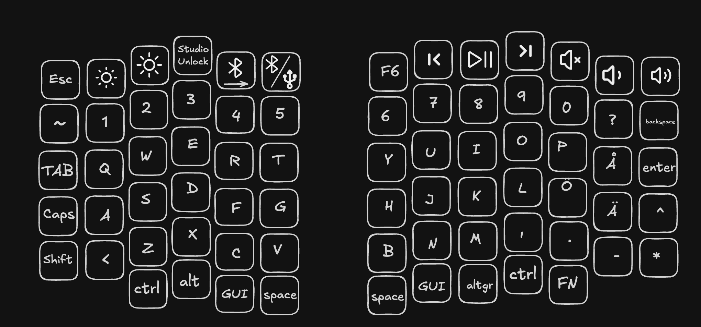
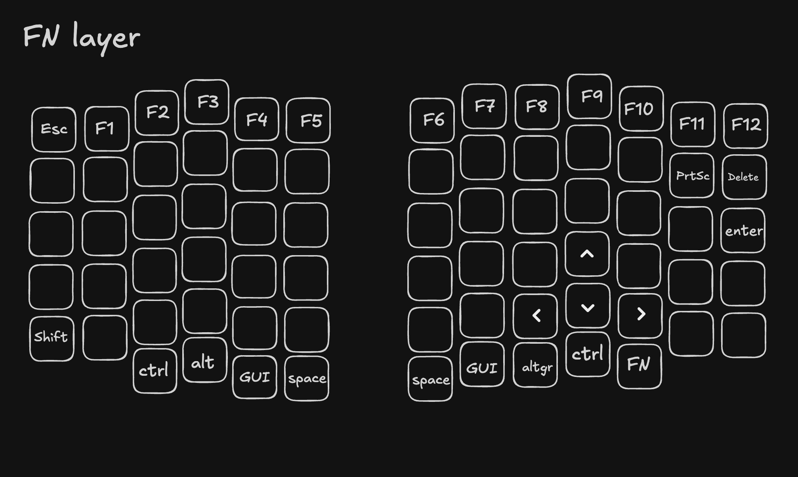

# Software

The keyboard is running ZMK which is the standard software used for wireless diy custom keyboards. Here is the [official docs for ZMK](https://zmk.dev/docs/features/split-keyboards). You might want to read this if you want to know more. I will still provide some instructions and info here as well as my own config files in the [the software repo](https://github.com/NoseFa/nordic-split-zmk) but if you need something else you should check the ZMK page.

The main points you might want to know are that one of the sides will be the host and it will drain more battery then the other side. This is because the "host" side will be communicating between the computer and the other side and the non host side will be just communicating with the host side. With the size of the batteries I used this wont be an issue but this technically means that you could use a bit of a smaller battery on one side and have the same battery life as the host side. The software is configured using a different config files that have the keymap and gpio layout etc. Then ZMK has a github action that can create the .uf2 file. The ready to install firmware is available in [the firmware folder](./firmware/). I have added ZMK studio support so some configuration of the keymap can be done through [the ZMK studio web tool](https://zmk.studio/). There is also a [native app](https://zmk.studio/download). This can be useful if you want to change the keymap but don't want to make a whole new .uf2 software file.

If you want to view to more specific config files and builds you can view [the software repo](https://github.com/NoseFa/nordic-split-zmk). If you're just looking to install the firmware you can use the files in the [firmware folder](./firmware). Remember that there are different files for each side.

## Installation

For installing you can grab the .uf2 files from the software folder. You can also edit the config files if you want to modify them and make your own .uf2 files. You can enter the flashing menu of the ProMicro by shorting the Rst(Reset) and GND pins for 0,5s. Then you can connect to your computer and the controller should show up as a Nice!Nano media. You can drop in the .uf2 file on it and it should install it. You have seperate firmware files for each side (LeftSide.uf2 and RightSide.uf2) check that you have the right one before you flash it. There are different layouts so this is important.

## Keymaps

Here are the two layers included in the firmware files. There are also two empty layers that you can use using ZMK studio to configure anything you want without having to run the build action again. The icons in the previews are from Iconify. These keymaps are made with the nordic layout in mind and they are the first keymap I have created so they can be a little bit weird.

