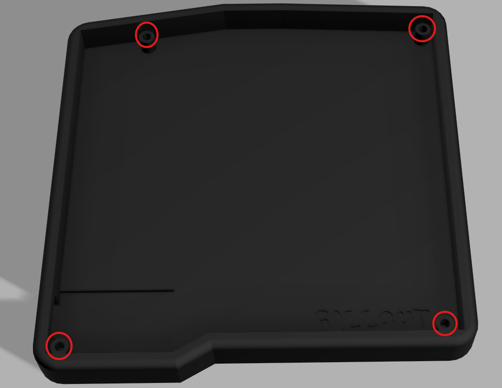
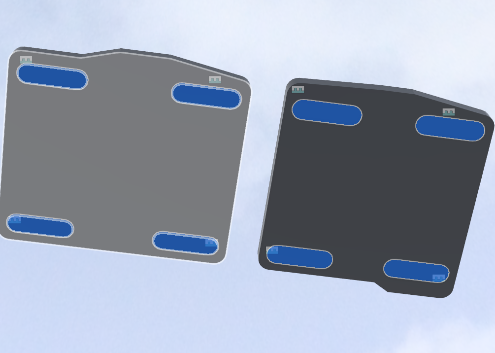

# Build guide

This will cover building the physical keyboard. Part choices and ordering will be covered first.

## Ordering parts

First you need to order the PCBs from a PCB manufacturer. (Technically nothing prevents you from hand wiring this keyboard but it would require some redesigning of the case and is outside the scope of my project). I ordered just the PCB instead of a PCBA. They are pretty small and you could order it as a PCBA with the diodes preinstalled. I think I can manage to solder them and I will save some money as well. You can order the PCB or PCBA from a manufacturer like [JLCPCB](https://jlcpcb.com/). I order the PCB from them. They have a minimum order size of 5. So I order 5 bare PCBs from them and moved onto the next parts.

When buying the microcontroller you should buy a NRF52840 based dev board just check that it has the same pin layout etc. This is the one I bought [ProMicro NRF52840](https://www.aliexpress.com/item/1005007205026373.html?spm=a2g0o.productlist.main.8.5285a54cPOmIpa&aem_p4p_detail=202603200108531573820844269200000457052&algo_pvid=ebbbcca8-17d4-4ca8-b59a-75b1f3198b0b&algo_exp_id=ebbbcca8-17d4-4ca8-b59a-75b1f3198b0b-7&pdp_ext_f=%7B%22order%22%3A%22771%22%2C%22eval%22%3A%221%22%2C%22fromPage%22%3A%22search%22%7D&pdp_npi=6%40dis%21EUR%214.49%213.16%21%21%2134.88%2124.54%21%40211b813f17739941330401522ee8fd%2112000039797470328%21sea%21FI%210%21ABX%211%210%21n_tag%3A-29910%3Bd%3Ab451bb2c%3Bm03_new_user%3A-29895%3BpisId%3A5000000197850273&curPageLogUid=OxA2oroU7gov&utparam-url=scene%3Asearch%7Cquery_from%3A%7Cx_object_id%3A1005007205026373%7C_p_origin_prod%3A&search_p4p_id=202603200108531573820844269200000457052_2) from aliexpress. It is pretty much a copy of the Nice!Nano. The PCB and software have been made with this board in mind.

For the case you can either 3D print it yourself or you can use a manufacturer like [JLC3DP](https://jlc3dp.com/) to print the case. Using a printing service isn't listed in the BOM because I have a 3D printer that I can use for this. Remember to order both sides. So in total you should have different 4 parts to print (both sides have a case and top plate). You can find the files in the [3D files folder](./3dFiles/). The [Full project folder](./3dFiles/FullProject/) has the full 3D project inc. PCB, switches etc. It's available in .step and .f3z formats. There is also a [3d Print folder](./3dFiles/3dPrint/). It has ready to print files in .step format. All parts can be printed in place without supports.

For keycaps you can either 3d print them or follow the [BOM](BOM.csv) where you can find the keycaps I bought from aliexpress and the keycaps weren't that expensive especially compared to the amount of work I would need to sand and post process them and buying filament. If you don't care as much about the finish you can find keycaps on printables like the [KEA choc keycaps](https://github.com/klouderone/KEA-choc-keycaps) by [Klouderone](https://github.com/klouderone) and [Ross Douglas](https://github.com/rdougla3) ([License for their project](https://github.com/klouderone/KEA-choc-keycaps/blob/main/CC%20BY-NC%204.0.txt)). The anti-slip feet aren't mandatory but the case does have ready made spots for them and they aren't too expensive. So there is some money to save if you print the keycaps etc.

For the other components like switches etc. you can look at [Bill of Materials](./BOM.csv). For the switches you can pick if you want clicky or linear etc. but the PCB is designed for choc v1 switches specifically.

## The case

Depending on the print quality you may want to wet sand the parts and add a few coats of paint. This isn't strictly necessary but it can improve the feel and finish of the part and can make them look better.

After printing the top plate and main body and maybe finishing the part. Then you can press in the heated inserts to the main shell of both sides. You should attach them to the case assembly (there are pre made holes for them). After this you can move onto preparing the PCB for assembly.

Here is a picture of the left side where I highlighted the heated insert spots. The right side is pretty much the same.

You should also install the non-slip pads to the bottom of the case if you bought them.

Here is a picture with the spots for the pads highlighted.

## Working on the PCB

First you should seperate the sides from each other. They are seperated by mouse bites so you should be able to just almost like snap them from each other. Then you can attach the diodes and hotswap sockets (These might be preinstalled if you used an assembly service when ordeing the parts from the manufacturer). The diodes can be annoying to solder so you might want to use solder paste and an oven to make installation easier. Then you should install the dev board (ProMicro NRF52840 if you followed the BOM).  You should have pre-installed pins or pins installed by you on the board and you can solder it to the pcb using them. Now I would suggest connecting to a computer and flashing the software (See [software flashing](./Software/software.md) section if you need help). You can use metallic tweezers to bridge a connection and test each socket without installing switches (Just bridge the two points).

After you have tested each key and checked that it works you can move onto the next step. If it doesn't work check your soldering of the dev board and check the PCB. When ordering from companies like JLCPCB you usually have to get a min of 5 boards so you have extras just incase. You can try one of the other boards incase one of the PCBs had a manufacturing mistake etc.

If everything works you should move onto installing the battery to the PCB. You can solder the battery to the pads on the PCB check that you attach the positive side to the BAT+ pad and the negative side to the GND pad. After this you can install the PCB into the case and you should place the battery in first (Having long enough battery leads might be a help here). If you want to you can use some double sided tape to keep the battery in place. Then you can place the battery in the holder made for it in the center of the case. Next you can place the PCB on top of the stand offs and you can move on to installing the top plate and move onto installing the switches. Both sides can be assembled in the same way so you can follow this guide for both.

## The switches

You should be able to just push in every switch. The hotswap sockets make this possible and there is no need to solder anything on the switches themselves. After the switches you should once again plug in both boards and check the firmware. When powered on the sides should sync together automatically. You should see only one keyboard in your bluetooth paring. Try to connect to it and test the keys. If everything works as intended you can install the keycaps and then your done.

## Software install

See [Software.md](./Software/software.md) for more info about software and software installation instructions. If you know what you're doing you can find the firmware files in the [Firmware folder](./Software/firmware/).
